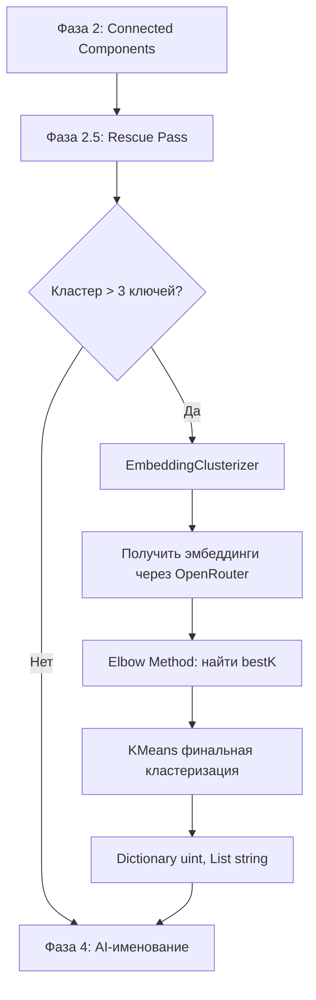

# План: Hybrid Embedding Clusterizer (ML.NET KMeans + Elbow Method)

## Цель

Заменить (или дополнить) Phase 3 — Semantic Map-Reduce через AI-тегизацию — на гибридную кластеризацию через **эмбеддинги + KMeans + Elbow Method**.

**Источник эмбеддингов:** OpenRouter, модель `text-embedding-3-small` (1536 измерений).  
**Кластеризатор:** ML.NET (`Microsoft.ML`) KMeans с автоопределением K по методу локтя.

---

## Схема интеграции в пайплайн



---

## Файлы для создания/изменения

### 1. `KeywordClusterizer/KeywordClusterizer.csproj` — добавить NuGet

Добавить пакет:
```
<PackageReference Include="Microsoft.ML" Version="4.0.1" />
```

### 2. `KeywordClusterizer/Models/EmbeddingData.cs` — НОВЫЙ файл

ML.NET-модели данных:

```csharp
namespace KeywordClusterizer.Models;

/// <summary>Входные данные для ML.NET: ключевой запрос + его эмбеддинг.</summary>
public class KeywordData
{
    public string Keyword { get; set; } = "";

    [VectorType(1536)]
    public float[] Embedding { get; set; } = [];
}

/// <summary>Результат предсказания кластера.</summary>
public class ClusterPrediction
{
    [ColumnName("PredictedLabel")]
    public uint SelectedClusterId { get; set; }
}
```

### 3. `KeywordClusterizer/Services/EmbeddingClusterizer.cs` — НОВЫЙ файл

Основной класс. Логика:

**Метод:** `ClusterKeywordsAsync(List<KeywordData> data) → Dictionary<uint, List<string>>`

**Алгоритм:**
1. Если `data.Count <= 3` → вернуть `{1: [все ключи]}` (K=1, кластеризация не нужна)
2. `maxK = Math.Min(8, data.Count / 2)`
3. Цикл `K = 1..maxK`:
   - Обучить KMeans (стандартные параметры)
   - Вызвать `mlContext.Clustering.Evaluate()` на тренировочных данных
   - Сохранить `metrics.AverageDistance` в массив `distances[K-1]`
4. Найти bestK методом локтя:
   - Если `maxK < 3` → bestK = maxK (нельзя посчитать ускорение)
   - Иначе для `k = 2..maxK-1`:
     `acceleration = (distances[k-2] - distances[k-1]) - (distances[k-1] - distances[k])`
   - bestK = K с максимальным `acceleration`
5. Финальный KMeans с `bestK`:
   - `MaximumNumberOfIterations = 100`
   - `OptimizationTolerance = 1e-4f`
6. Предсказать кластер для каждого элемента через `PredictionEngine`
7. Сгруппировать по `SelectedClusterId` → `Dictionary<uint, List<string>>`

**Важно:** ML.NET KMeans требует, чтобы данные были загружены в `IDataView`. Для оценки (`Evaluate`) нужно разделить данные на train + test, либо использовать кросс-валидацию. Оптимальный подход:
- Обучаем KMeans на всех данных (unsupervised — нет таргета)
- Для `Evaluate()` используем `mlContext.Clustering.Evaluate()` на тех же данных — метрика `AverageDistance` покажет среднее расстояние от точек до центроидов
- После поиска bestK — обучаем финальную модель на всех данных

### 4. `KeywordClusterizer/ClusterizationPipeline.cs` — ИЗМЕНИТЬ Phase 3

Заменить текущую AI-тегизацию на вызов `EmbeddingClusterizer`:

```csharp
// Вместо TagKeywordsAsync для каждого кластера:
var embedClusterizer = new EmbeddingClusterizer();
var keywordDataList = cluster.Select(k => new KeywordData
{
    Keyword = k,
    Embedding = await GetEmbeddingAsync(k) // через OpenRouter
}).ToList();

var subClusters = embedClusterizer.ClusterKeywords(keywordDataList);
foreach (var kvp in subClusters)
    finalClusters.Add(kvp.Value);
```

**Проблема:** Получение эмбеддингов через OpenRouter — это HTTP-запрос к API. Нужен:
- `OpenRouterEmbeddingClient` (или метод в `DeepSeekHelper`/новый сервис)
- Кэширование эмбеддингов (уже есть `SerpCacheService` как образец)
- Обработка rate limits и ошибок

### 5. `KeywordClusterizer/Services/OpenRouterEmbeddingClient.cs` — НОВЫЙ файл

Клиент для получения эмбеддингов через OpenRouter API с **кэшированием на диск** (аналогично `SerpCacheService`):

```csharp
public class OpenRouterEmbeddingClient
{
    private readonly HttpClient _client;
    private readonly string _apiKey;
    private readonly string _cachePath;  // путь к файлу кэша
    private Dictionary<string, float[]> _cache;  // текст → эмбеддинг
    
    public async Task<float[]> GetEmbeddingAsync(string text);
    public async Task<Dictionary<string, float[]>> GetEmbeddingsBatchAsync(List<string> texts);
    public void SaveCache();
}
```

**API OpenRouter для эмбеддингов:**
- Endpoint: `https://openrouter.ai/api/v1/embeddings`
- Модель: `text-embedding-3-small`
- Размерность: 1536

**Кэширование:**
- `_cache` — `Dictionary<string, float[]>` в памяти (текст → эмбеддинг)
- Перед запросом к API проверяем `_cache`
- После получения батча сохраняем в `_cache`
- `SaveCache()` записывает на диск JSON (как `SerpCacheService`)
- Загрузка из файла при инициализации

### 6. `KeywordClusterizer/Models/OpenRouterSettings.cs` — НОВЫЙ файл

Настройки для OpenRouter:
```csharp
public class OpenRouterSettings
{
    public string ApiKey { get; set; } = "";
    public string EmbeddingModel { get; set; } = "text-embedding-3-small";
}
```

Добавить секцию `"openrouter"` в `settings.json`.

### 7. `KeywordClusterizer/Program.cs` — ИЗМЕНИТЬ

- Загружать `openRouterSettings` из `settings.json`
- Передавать в `ClusterizationPipeline`

---

## Порядок реализации (Todo)

| # | Задача | Файл |
|---|--------|------|
| 1 | Добавить `Microsoft.ML` NuGet в `.csproj` | `KeywordClusterizer.csproj` |
| 2 | Создать модель `KeywordData` + `ClusterPrediction` | `Models/EmbeddingData.cs` |
| 3 | Создать `OpenRouterSettings` модель | `Models/OpenRouterSettings.cs` |
| 4 | Создать `OpenRouterEmbeddingClient` | `Services/OpenRouterEmbeddingClient.cs` |
| 5 | Создать `EmbeddingClusterizer` с Elbow Method | `Services/EmbeddingClusterizer.cs` |
| 6 | Обновить `settings.json` (добавить openrouter секцию) | `settings.json` |
| 7 | Обновить `Program.cs` (загрузка OpenRouter настроек) | `Program.cs` |
| 8 | Обновить `ClusterizationPipeline.cs` (Phase 3 → эмбеддинги) | `ClusterizationPipeline.cs` |
| 9 | `dotnet build` — 0 errors, 0 warnings | — |
| 10 | `dotnet run` — проверка на реальных данных | — |

---

## Технические детали

### Метод Локтя (Elbow Method) — формула

```
distances[K] = AverageDistance при K кластерах

Для K от 2 до maxK-1:
  acceleration[K] = (distances[K-2] - distances[K-1]) - (distances[K-1] - distances[K])
  //                   замедление падения 1    -     замедление падения 2
  // Где больше ускорение — там и локоть

bestK = argmax(acceleration)
```

### ML.NET KMeans — пример кода

```csharp
var mlContext = new MLContext(seed: 42);

// Загрузка данных
var dataView = mlContext.Data.LoadFromEnumerable(keywordDataList);

// Пайплайн: конкатенация признаков + KMeans
var pipeline = mlContext.Transforms.Concatenate("Features", nameof(KeywordData.Embedding))
    .Append(mlContext.Clustering.Trainers.KMeans(
        numberOfClusters: K,
        options: new KMeansTrainer.Options
        {
            MaximumNumberOfIterations = 100,
            OptimizationTolerance = 1e-4f
        }));

// Обучение
var model = pipeline.Fit(dataView);

// Оценка
var predictions = model.Transform(dataView);
var metrics = mlContext.Clustering.Evaluate(predictions);
// metrics.AverageDistance — среднее расстояние до центроида

// Предсказание
var predictionEngine = mlContext.Model.CreatePredictionEngine<KeywordData, ClusterPrediction>(model);
foreach (var item in keywordDataList)
{
    var prediction = predictionEngine.Predict(item);
    // prediction.SelectedClusterId
}
```

### OpenRouter Embeddings API — пример запроса

```json
POST https://openrouter.ai/api/v1/embeddings
Authorization: Bearer sk-...
Content-Type: application/json

{
  "model": "text-embedding-3-small",
  "input": ["бачок унитаза кнопка", "клапан бачка унитаза"]
}
```

Ответ:
```json
{
  "data": [
    { "object": "embedding", "index": 0, "embedding": [0.001, ...] },
    { "object": "embedding", "index": 1, "embedding": [0.002, ...] }
  ],
  "model": "text-embedding-3-small",
  "usage": { "prompt_tokens": 10, "total_tokens": 10 }
}
```

---

## Open вопросы к пользователю

1. API-ключ OpenRouter — будет отдельный или используем тот же DeepSeek-ключ? (OpenRouter может принимать DeepSeek-ключ, но лучше отдельный)
2. Нужно ли кэшировать эмбеддинги на диск? (как SERP-кэш)
3. Оставить ли AI-тегизацию как fallback, если эмбеддинги не получены?
4. Показывать ли "сырые" группы по `uint` ID или сразу отправлять их на AI-именование (Phase 4)?
