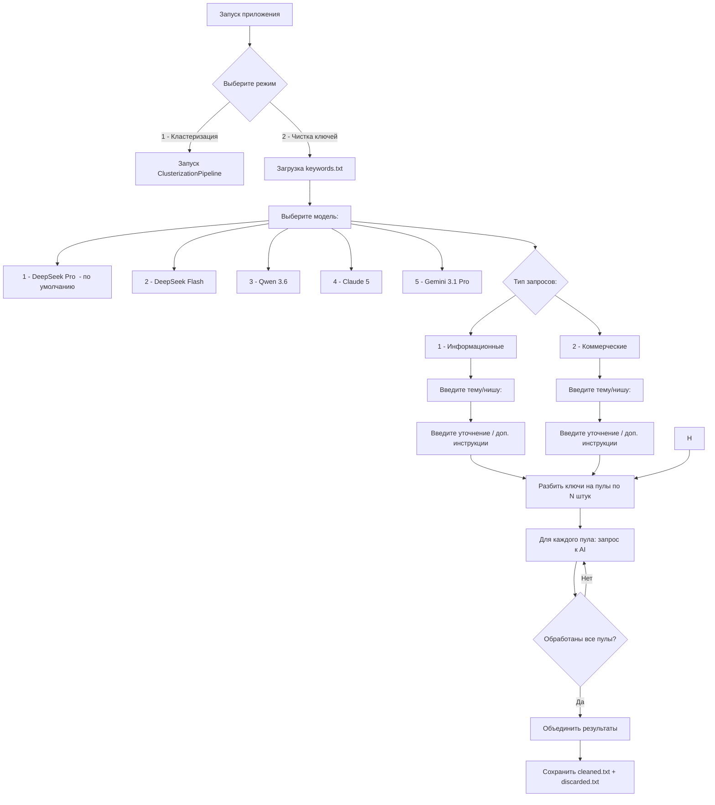
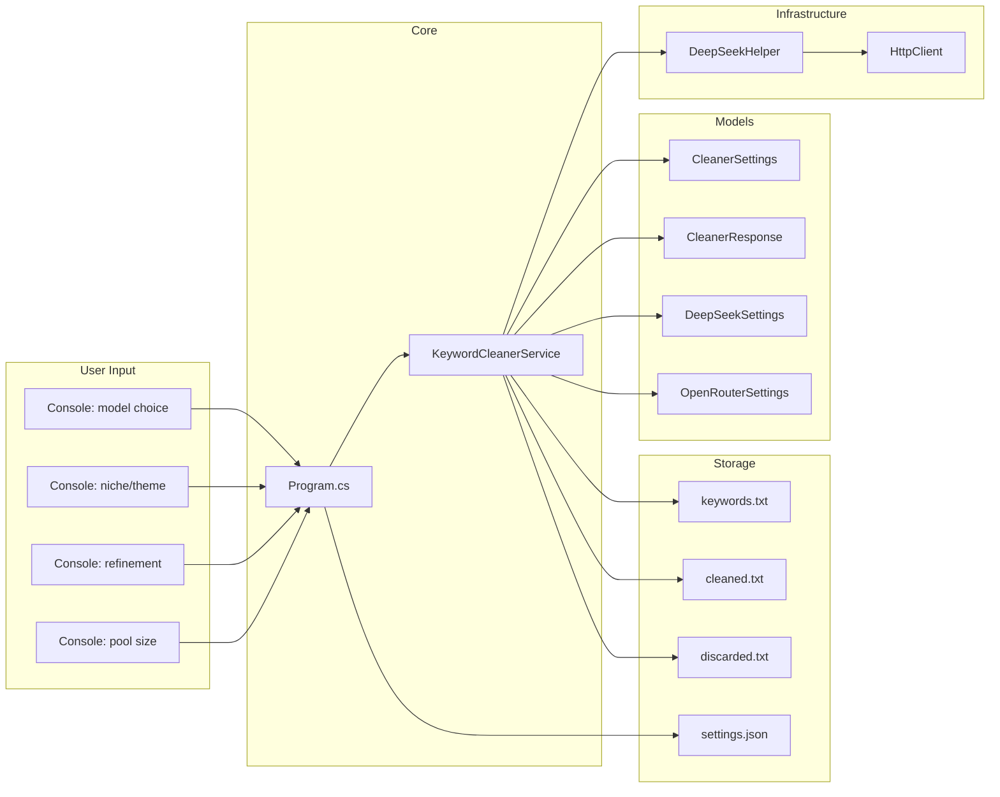

# План: Приложение для чистки ключевых запросов

## 1. Общая архитектура

Новое приложение встраивается в существующий проект [`KeywordClusterizer`](KeywordClusterizer/) как второй режим работы.

```
KeywordClusterizer.sln
├── Program.cs                 ← модифицируем: меню выбора режима
├── KeywordCleanerService.cs   ← НОВЫЙ: логика чистки пулами
├── Models/
│   ├── CleanerSettings.cs     ← НОВЫЙ: настройки cleaner
│   ├── CleanerResponse.cs     ← НОВЫЙ: модель ответа AI
│   └── ... (существующие)
├── DeepSeekHelper.cs          ← переиспользуем без изменений
├── keywords.txt               ← общий для обоих режимов
├── settings.json              ← добавляем секцию "cleaner"
└── ...
```

## 2. Поток работы (user flow)



## 3. Маршрутизация моделей

| Выбор пользователя | model ID | Endpoint | API Key |
|---|---|---|---|
| 1 - DeepSeek Pro | `deepseek-v4-pro` | `api.deepseek.com` | `settings.apiKey` |
| 2 - DeepSeek Flash | `deepseek-v4-flash` | `api.deepseek.com` | `settings.apiKey` |
| 3 - Qwen 3.6 | TBD (напр. `qwen/qwq-3.6`) | `openrouter.ai/api/v1/chat/completions` | `settings.openrouter.apiKey` |
| 4 - Claude 5 | TBD (напр. `anthropic/claude-sonnet-5`) | `openrouter.ai/api/v1/chat/completions` | `settings.openrouter.apiKey` |
| 5 - Gemini 3.1 Pro | TBD (напр. `google/gemini-3.1-pro`) | `openrouter.ai/api/v1/chat/completions` | `settings.openrouter.apiKey` |

**Логика:**
- DeepSeek модели → идут через `api.deepseek.com` напрямую (endpoint по умолчанию в [`DeepSeekHelper`](KeywordClusterizer/DeepSeekHelper.cs))
- Остальные → через OpenRouter endpoint, с `skipDeepSeekFields: true` и `apiKeyOverride: openRouterSettings.ApiKey`

## 4. Инструкции для чистки (файлы)

Промпты хранятся в отдельных `.txt` файлах в папке `instructions/`, аналогично существующему [`phase4_ai_merge.txt`](KeywordClusterizer/instructions/phase4_ai_merge.txt).

Два файла:

- [`instructions/cleaner_informational.txt`](KeywordClusterizer/instructions/cleaner_informational.txt) — промпт для информационных запросов
- [`instructions/cleaner_commercial.txt`](KeywordClusterizer/instructions/cleaner_commercial.txt) — промпт для коммерческих запросов

Файлы загружаются при старте по пути из `settings.json`. Если файл не найден — приложение завершается с ошибкой: `[ОШИБКА] Файл инструкции не найден: {path}`.

## 5. Новая модель CleanerSettings

Добавить секцию `cleaner` в [`settings.json`](.gitignore:23):

```json
{
  "apiKey": "...",
  "deepseek": { ... },
  "openrouter": { ... },
  "cleaner": {
    "defaultModel": "deepseek-v4-pro",
    "defaultPoolSize": 1000,
    "outputCleaned": "cleaned.txt",
    "outputDiscarded": "discarded.txt",
    "instructionsInformational": "instructions/cleaner_informational.txt",
    "instructionsCommercial": "instructions/cleaner_commercial.txt"
  }
}
```

Новая C# модель [`CleanerSettings.cs`](KeywordClusterizer/Models/CleanerSettings.cs):

```csharp
public class CleanerSettings
{
    public string DefaultModel { get; set; } = "deepseek-v4-pro";
    public int DefaultPoolSize { get; set; } = 1000;
    public string OutputCleaned { get; set; } = "cleaned.txt";
    public string OutputDiscarded { get; set; } = "discarded.txt";
    public string InstructionsInformational { get; set; } = "instructions/cleaner_informational.txt";
    public string InstructionsCommercial { get; set; } = "instructions/cleaner_commercial.txt";
    
    /// <summary>Загружает промпт из файла. Если файла нет — возвращает null.</summary>
    public string? LoadPrompt(QueryType queryType)
    {
        var path = queryType == QueryType.Informational
            ? InstructionsInformational
            : InstructionsCommercial;
        if (!File.Exists(path))
        {
            Console.ForegroundColor = ConsoleColor.Red;
            Console.WriteLine($"[ОШИБКА] Файл инструкции не найден: {path}");
            Console.ResetColor();
            return null;
        }
        return File.ReadAllText(path);
    }
}
```

А также enum для типа запросов:

```csharp
public enum QueryType
{
    Informational,
    Commercial
}
```

## 5. Ответ AI (CleanerResponse)

```csharp
public class CleanerResponse
{
    [JsonPropertyName("cleaned")]
    public List<string> Cleaned { get; set; } = new();
    
    [JsonPropertyName("discarded")]
    public List<string> Discarded { get; set; } = new();
}
```

## 6. Ключевой класс: KeywordCleanerService

```csharp
public class KeywordCleanerService
{
    private readonly HttpClient _client;
    private readonly DeepSeekSettings _deepSeekSettings;
    private readonly OpenRouterSettings _openRouterSettings;
    private readonly CleanerSettings _cleanerSettings;

    // Основной метод
    public async Task RunAsync(List<string> keywords);
    
    // Шаг 1: запросить у пользователя параметры
    private (int modelChoice, QueryType queryType, string niche, string refinement, int poolSize) GetUserInput();
    
    // Шаг 2: разбить на пулы
    private List<List<string>> SplitIntoPools(List<string> keywords, int poolSize);
    
    // Шаг 3: очистить один пул через API
    private async Task<CleanerResponse> CleanPoolAsync(List<string> pool, string systemPrompt);
    
    // Шаг 4: определить endpoint и ключ по выбору модели
    private (string endpoint, string apiKey, bool skipDeepSeekFields) ResolveModelEndpoint(int modelChoice);
    
    // Шаг 5: сохранить результаты
    private void SaveResults(CleanerResponse aggregated);
}
```

## 7. Модификация Program.cs

```csharp
static async Task Main(string[] args)
{
    Console.WriteLine("=== Кластеризатор / Чистильщик ключевых слов ===");
    Console.WriteLine("1 - Кластеризация");
    Console.WriteLine("2 - Чистка ключей");
    Console.Write("Выберите режим (1/2): ");
    
    var choice = Console.ReadLine()?.Trim();
    
    // Загрузка настроек (общая для обоих режимов)
    LoadSettings(...);
    
    // Загрузка keywords.txt (общая)
    var keywords = LoadKeywords("keywords.txt");
    
    if (choice == "2")
    {
        var cleaner = new KeywordCleanerService(...);
        await cleaner.RunAsync(keywords);
    }
    else
    {
        // существующий пайплайн кластеризации
    }
}
```

## 8. Размер пула

- По умолчанию 1000 ключей на пул
- Пользователь может ввести своё значение (или Enter для 1000)
- Если ключей меньше pool_size → весь файл = один пул

## 9. Обработка ошибок

- При ошибке API для одного пула — пропустить пул, записать в лог, продолжить со следующим
- Прогресс-бар в консоли: `Обработано: 3/10 пулов`
- Если пул не удалось обработать → ключи из него попадают в discarded (чтобы не потерялись)

## 10. Выходные файлы

- **`cleaned.txt`** — по одному ключу на строку, только релевантные
- **`discarded.txt`** — по одному ключу на строку, отброшенные

Файлы сохраняются рядом с `keywords.txt` (в `KeywordClusterizer/`).

## 11. Todo-list для реализации

1. **Создать файлы инструкций:**
   - [`instructions/cleaner_informational.txt`](KeywordClusterizer/instructions/cleaner_informational.txt)
   - [`instructions/cleaner_commercial.txt`](KeywordClusterizer/instructions/cleaner_commercial.txt)
2. **Создать модель [`CleanerSettings.cs`](KeywordClusterizer/Models/CleanerSettings.cs)** — поля: InstructionsInformational, InstructionsCommercial, DefaultPoolSize, DefaultModel, OutputCleaned, OutputDiscarded + LoadPrompt()
3. **Создать модель [`CleanerResponse.cs`](KeywordClusterizer/Models/CleanerResponse.cs)** — Cleaned + Discarded
4. **Создать enum [`QueryType.cs`](KeywordClusterizer/Models/QueryType.cs)** — Informational, Commercial
5. **Создать сервис [`KeywordCleanerService.cs`](KeywordClusterizer/KeywordCleanerService.cs)** — вся логика чистки
6. **Модифицировать [`Program.cs`](KeywordClusterizer/Program.cs)** — меню выбора режима
7. **Расширить [`settings.json`](.gitignore:23)** — секция `cleaner`
8. **Обновить `.gitignore`** — `cleaned.txt`, `discarded.txt`
9. **Обновить `.csproj`** — CopyToPublishDirectory для `instructions/cleaner_*.txt`
10. **Протестировать** — оба режима

## 12. Схема взаимодействия компонентов



