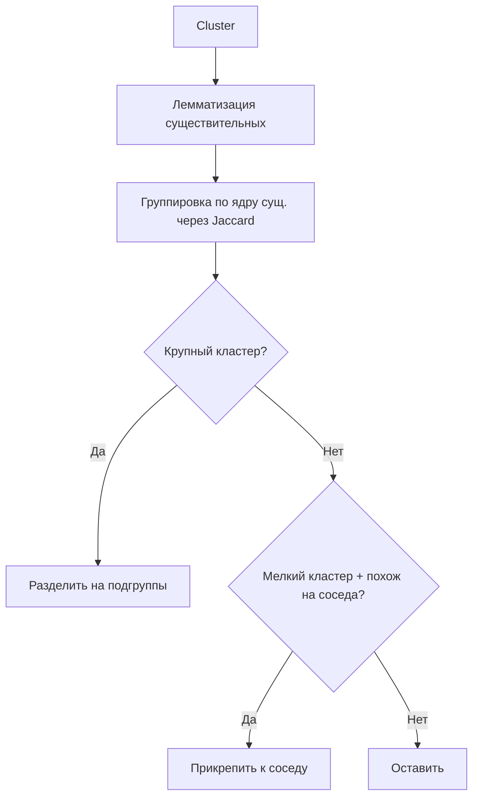

# План: Linguistic Merge Pass (N-граммы + Jaccard Index)

## Анализ на примере

Кластер **"как работает смывной бачок унитаза"** (22 ключа).

### Шаг 1: Лемматизация существительных

После удаления предлогов/глаголов и приведения к норме:

| Ключ | Леммы (сущ.) | Глагол |
|------|-------------|--------|
| как работает смывной бачок унитаза | бачок, унитаз, смыв | работать |
| как работает сливной бачок унитаза | бачок, унитаз, слив | работать |
| как работает набор воды в бачке унитаза | набор, вода, бачок, унитаз | работать |
| как устроена система слива в бачке унитаза | система, слив, бачок, унитаз | устроить |
| как устроен бак унитаза | бак, унитаз | устроить |
| как устроен смывной бачок унитаза | бачок, унитаз, смыв | устроить |
| как работает смыв бачка унитаза | смыв, бачок, унитаз | работать |
| как устроены сливные бачки унитаза | слив, бачок, унитаз | устроить |
| как устроен слив унитаза | слив, унитаз | устроить |
| как устроен сливной бачок унитаза | слив, бачок, унитаз | устроить |
| как устроена система бачка унитаза | система, бачок, унитаз | устроить |
| как устроен механизм слива бачка унитаза | механизм, слив, бачок, унитаз | устроить |
| как работает система бачка унитаза | система, бачок, унитаз | работать |
| как работает система слива в бачке унитаза | система, слив, бачок, унитаз | работать |
| как устроен бачок унитаза | бачок, унитаз | устроить |
| как устроен сифон унитаза | сифон, унитаз | устроить |
| как работает поплавок в бачке унитаза | поплавок, бачок, унитаз | работать |
| как устроен поплавок в бачке унитаза | поплавок, бачок, унитаз | устроить |
| как устроен бачок унитаза старого образца | бачок, унитаз, образец | устроить |
| как устроен слив унитаза в канализацию | слив, унитаз, канализация | устроить |
| как стоит поплавок в бачке унитаза | поплавок, бачок, унитаз | стоять |
| как работает двойной слив бачка унитаза | слив, бачок, унитаз | работать |

### Шаг 2: Jaccard-группировка

Ключи группируются по набору существительных (Jaccard > 0.6):

| Группа | Сущ. ядро | Ключей |
|--------|-----------|--------|
| **Смыв/слив** | {слив, бачок, унитаз} + {смыв} | 12 |
| **Поплавок** | {поплавок, бачок, унитаз} | 3 |
| **Система/механизм** | {система, механизм, бачок, унитаз} | 4 |
| **Сифон** | {сифон, унитаз} | 1 |
| **Бак** | {бак, унитаз} | 1 |
| **Канализация** | {канализация, слив, унитаз} | 1 |

**Результат:** 22 ключа → **~6 логических подгрупп** (поплавок, сифон, бак отделяются от основной массы).

### Шаг 3: Слияние мелких кластеров

Если после Phase 3 остались синглтоны или мелкие кластеры (1-2 ключа) с Jaccard > 0.6 к соседнему — они прикрепляются.

---

## Архитектура



## Файлы для реализации

### 1. NuGet: `DeepMorphy` (или `NLTK.Stemmer`)

### 2. `Services/LinguisticClusterAnalyzer.cs`

Методы:
- `GetLemmas(string keyword)` → `(string verb, string[] nouns)`
- `ComputeJaccard(string[] a, string[] b)` → float
- `SplitCluster(List<string> cluster, float threshold)` → `List<List<string>>`
- `MergeSimilar(List<List<string>> clusters, float threshold)` → `List<List<string>>`

### 3. Интеграция в пайплайн

После Phase 3, если `mergeMode == "linguistic"`:
1. Разделить крупные кластеры (по noun-профилям, Jaccard < 0.6 → разные группы)
2. Слить мелкие кластеры с похожими соседями (Jaccard > 0.6)

### 4. Настройки

```json
"mergeMode": "linguistic",
"linguisticThreshold": 0.6,
"linguisticSplitThreshold": 0.6  // если Jaccard ниже — разделять
```

## Todo

1. Добавить NuGet DeepMorphy
2. Создать `Services/LinguisticClusterAnalyzer.cs`
3. Интегрировать в пайплайн
4. dotnet build
