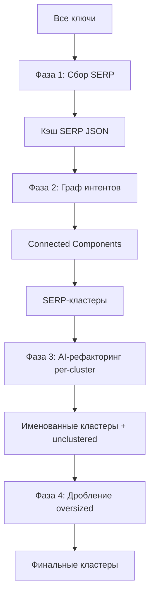

# SERP-First Architecture — План реализации

## Суть

Полная смена пайплайна: вместо AI-кластеризации с последующей SERP-проверкой, делаем **SERP-кластеризацию через теорию графов**, а AI используем только для именования, чистки и дробления.



---

## Фаза 1: Сбор SERP (Ground Truth)

### Что меняется в XmlRiverClient

- **Кэширование**: JSON-файл `serp_cache.json` в корне проекта
  - Ключ: keyword (base64 encoded для безопасности спецсимволов)
  - Значение: полный `KeywordSearchResult` (Urls, Titles, Domains, Results)
  - Перед API-запросом: проверка кэша
  - После успешного ответа: запись в кэш
- **Параллельный опрос**: через `SearchBatchAsync()`, `maxConcurrency` потоков

### Новые файлы

| Файл | Назначение |
|------|------------|
| `Services/SerpCacheService.cs` | Чтение/запись JSON-кэша, проверка по ключу |

### Настройки (добавить в XmlRiverSettings)

```json
"serp": {
  "enableCache": true,
  "cachePath": "serp_cache.json"
}
```

### Вход
- `List<string>` — ВСЕ ключевые слова (100-1000+ шт.)
- `TopResultsCount = 10`

### Выход
- `Dictionary<string, KeywordSearchResult>` — для каждого ключа SERP-результаты

---

## Фаза 2: Граф интентов (Connected Components)

### Новый файл: `Services/SerpGraphClusterizer.cs`

Это **ядро** новой архитектуры. Никакого AI — чистая математика.

### Алгоритм

```
Для каждой пары ключей (u, v):
  overlap = |SERP[u].Urls ∩ SERP[v].Urls|
  если overlap >= T (T=3 по умолчанию):
    добавить ребро u ↔ v

Компоненты связности (BFS/DFS):
  visited = {}
  для каждого ключа:
    если не visited:
      BFS(ключ) -> cluster
```

### Сложность
- N ключей → N²/2 сравнений
- Для 1000 ключей: ~500K проверок пересечения
- Каждая проверка: пересечение 2 списков по 10 URL → через HashSet ≈ O(10)
- Итого: ~5M операций — выполняется за секунды

### Параметры (в XmlRiverSettings)

```json
"serp": {
  "overlapThreshold": 3,
  "useAbsoluteOverlap": true
}
```

Если `useAbsoluteOverlap = false` — использует Jaccard (старый метод).

### Вход
- `Dictionary<string, KeywordSearchResult>` — SERP для всех ключей
- `overlapThreshold = 3`

### Выход
- `List<List<string>>` — список кластеров (списков ключей)
- Ключи, у которых нет ни одного ребра → автоматически `unclustered`

---

## Фаза 3: AI-рефакторинг per-cluster (DeepSeek-Reasoner)

### В новом пайплайне

Вместо того чтобы отправлять ВСЕ кластеры в AI одной порцией (как сейчас Step 3), отправляем **каждый SERP-кластер отдельно**.

### Инструкция: `instructions/serp_cluster_refine.txt`

```
[ЗАДАЧА: ИМЕНОВАНИЕ И ЧИСТКА SERP-КЛАСТЕРА]

Ниже приведены ключевые слова, которые Яндекс считает одним интентом
(у них совпадают сайты в Топ-10 выдачи).

Твои задачи:
1. Выбери лучший ключ как название кластера (будущий H1 страницы).
2. Если среди ключей есть 1-2 логически несовместимых — удали их в unclustered.
3. Определи тип страницы: категория / карточка товара / статья в блог / услуга.
4. ВЕРНИ ВСЕ КЛЮЧИ без потерь. Ключи которые не подходят — в unclustered.

Формат ответа:
{"cluster_name": "...", "page_type": "...", "keywords": [...], "unclustered": [...]}
```

### Процесс в `ClusterizationPipeline.cs`

```
для каждого SERP-кластера:
  отправить в deepseek-reasoner
  получить: cluster_name, page_type, keywords, unclustered
  объединить unclustered в общий пул
```

### Вход
- Один SERP-кластер — список ключей (обычно 3-50 шт.)
- Инструкция `serp_cluster_refine.txt`

### Выход
- `Dictionary<string, List<string>>` — именованные AI-кластеры
- `List<string>` — unclustered (аномалии, вычищенные AI)
- `Dictionary<string, string>` — cluster_name → page_type

### Модель
- `deepseek-reasoner` — для аналитического именования и очистки
- Каждый кластер обрабатывается отдельно (маленький промпт)

---

## Фаза 4: Дробление oversized (DeepSeek-Chat)

Только для кластеров, превышающих `maxClusterSize`.

### Инструкция: `instructions/serp_split_oversized.txt`

```
[ЗАДАЧА: РАЗБИВКА ШИРОКОГО ИНТЕНТА]

Данная группа запросов имеет один интент, но слишком большая
для одной страницы ({size} ключей, лимит {maxSize}).

Разбей её на логические подгруппы по {maxSize} ключей,
выделяя специфичные свойства: по гео, по цвету, по типу, по материалу.

Каждая подгруппа = отдельная узкая страница.
Верни ВСЕ ключи без потерь.

Формат ответа: {"clusters": [{"cluster_name": "...", "keywords": [...]}], "unclustered": [...]}
```

### Процесс

```
для каждого кластера с Count > maxClusterSize:
  отправить в deepseek-chat с инструкцией splitting
  заменить старый кластер новыми (разбитыми)
```

### Модель
- `deepseek-chat` — творческое дробление по свойствам

---

## Схема нового пайплайна

```mermaid
flowchart TD
    subgraph "Фаза 1: DATA"
        A1[Все ключи] --> A2[XmlRiver SearchBatchAsync<br/>maxConcurrency потоков]
        A2 --> A3[SerpCacheService<br/>read/write JSON]
        A3 --> A4[Dict keyword -> KeywordSearchResult]
    end

    subgraph "Фаза 2: GRAPH"
        B1[Dict keyword -> SERP] --> B2[SerpGraphClusterizer]
        B2 --> B3[Для каждой пары: overlap >= T?]
        B3 --> B4[Connected Components BFS]
        B4 --> B5[List[List keyword]] + unclustered
    end

    subgraph "Фаза 3: AI REFINE"
        C1[Каждый SERP-кластер] --> C2[deepseek-reasoner<br/>per cluster]
        C2 --> C3[Именование + чистка]
        C3 --> C4[cluster_name, page_type<br/>keywords, unclustered]
        C4 --> C5[Общий пул unclustered]
    end

    subgraph "Фаза 4: SPLIT"
        D1[Проверка размера] --> D2{Count > maxSize?}
        D2 -->|Да| D3[deepseek-chat<br/>split oversized]
        D2 -->|Нет| D4[Оставить как есть]
        D3 --> D5[Разбитые подкластеры]
    end

    A4 --> B1
    B5 --> C1
    C5 --> D6[Нераспределённые]
    D5 --> E[Финальные кластеры]
    D4 --> E
    D6 --> E
```

---

## Какие файлы нужно создать/изменить

### Новые файлы

| # | Файл | Назначение |
|---|------|------------|
| 1 | `Services/SerpCacheService.cs` | JSON-кэш SERP-результатов |
| 2 | `Services/SerpGraphClusterizer.cs` | Граф интентов + Connected Components |
| 3 | `instructions/serp_cluster_refine.txt` | Инструкция для AI-именования кластеров |
| 4 | `instructions/serp_split_oversized.txt` | Инструкция для дробления oversized |

### Изменяемые файлы

| # | Файл | Что меняем |
|---|------|------------|
| 5 | `XmlRiverClient.cs` | Добавить поддержку кэша (inject SerpCacheService) |
| 6 | `ClusterizationPipeline.cs` | Переписать RunAsync — новый 4-фазный пайплайн |
| 7 | `Models/XmlRiverSettings.cs` | Добавить enableCache, cachePath, overlapThreshold, useAbsoluteOverlap |
| 8 | `settings.json` | Обновить секцию serp |
| 9 | `Program.cs` | Подгрузка новых настроек |
| 10 | `DeepSeekResponse.cs` | Добавить `PageType` в ClusterItem |

### Можно удалить (не нужно в новой архитектуре)

| Файл | Почему |
|------|--------|
| `SerpClusterValidator.cs` | Заменяется SerpGraphClusterizer |
| `instructions/step1_draft.txt` | Больше нет AI-Draft |
| `instructions/step2_mapping.txt` | Больше нет Mapping |
| `instructions/refinement_iteration.txt` | Заменяется serp_split_oversized |
| `instructions/merge_deduplication.txt` | SERP-кластеры уже дедуплицированы графом |
| `instructions/serp_context_block.txt` | Больше не нужен (SERP-first) |
| `XmlRiverSettings.EnableValidation` | Больше не нужен |
| `XmlRiverSettings.MinOverlap` | Заменяется overlapThreshold |
| `XmlRiverSettings.SampleSize` | Больше не нужен (опрос ВСЕХ ключей) |
| `XmlRiverSettings.EnableFinalValidation` | Больше не нужен |
| `XmlRiverSettings.EnabledForDraft` | Больше не нужен |

---

## Ключевые риски и решения

| Риск | Решение |
|------|---------|
| N² сравнений для 2000+ ключей | Оптимизация: группировка по доменам, предварительная фильтрация |
| XmlRiver лимит запросов | Кэш + maxConcurrency + паузы |
| SERP-кластер > 200 ключей | BFS работает нормально, дробление в Фазе 4 |
| Ключ без SERP (пустой ответ) | Автоматически в unclustered |
| Переходный период | Старый код остаётся в git-history, новая ветка `feature/serp-first` |

---

## Оценка стоимости API

- N = 1000 ключей
- XmlRiver: ~2 руб/1000 запросов. 1000 запросов = ~2 руб
- При повторных запусках: кэш → доп. расходов нет
- DeepSeek Reasoner: ~$2/1M токенов. Для 30 кластеров × ~500 токенов = 15K токенов → копейки
- DeepSeek Chat: аналогично
