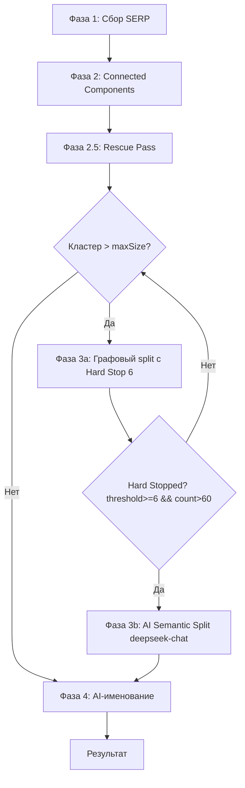

# План доработок SERP-first пайплайна

## Текущая архитектура

```
Фаза 1: Сбор SERP (XmlRiver для всех ключей)
Фаза 2: Граф интентов (Connected Components) → clusters + unclustered
Фаза 3: Рекурсивное графовое дробление (SplitOversizedRecursive)
Фаза 4: AI-именование per-cluster (deepseek-reasoner)
```

## Изменения

### 1. Hard Stop threshold=6 в SplitOversizedRecursive

**Где:** [`ClusterizationPipeline.cs:216`](KeywordClusterizer/ClusterizationPipeline.cs:216) — `SplitOversizedRecursive()`

**Что:** Добавить условие в guard clause:
```csharp
if (cluster.Count <= maxSize || currentThreshold > _serpSettings.TopResultsCount
    || (currentThreshold >= 6 && cluster.Count > maxSize))
```
При `threshold >= 6` И `count > maxSize` — рекурсия останавливается. Кластер возвращается как hard-stopped.

**Почему:** 6 совпадений URL из 10 — железобетонный сигнал единого интента. Дальнейшее повышение порога бессмысленно. Граф не может разбить то, что математически является одной компонентой связности.

---

### 2. Новая Фаза 3b: AI Semantic Split (Map-Reduce)

**Где:** [`ClusterizationPipeline.cs:123-149`](KeywordClusterizer/ClusterizationPipeline.cs:123) — блок Фазы 3

**Что:** После графового дробления (Фаза 3a), найти кластеры, которые до сих пор > `maxClusterSize`. Это hard-stopped кластеры. Отправить каждый в `SplitClusterAsync()` — существующий метод, который использует [`serp_split_oversized.txt`](KeywordClusterizer/instructions/serp_split_oversized.txt) и `deepseek-chat`.

```csharp
// Фаза 3a: Рекурсивное графовое дробление (с Hard Stop 6)
// ... существующий код Фазы 3 ...

// Фаза 3b: AI Semantic Split для hard-stopped кластеров
var finalSplitClusters = new List<List<string>>();
foreach (var cluster in splitClusters)
{
    if (cluster.Count > maxClusterSize)
    {
        Console.WriteLine($"  Hard-stopped кластер {cluster.Count} ключей → AI semantic split...");
        var aiSplit = await SplitClusterAsync(cluster, maxClusterSize);
        if (aiSplit != null && aiSplit.Count > 0)
        {
            foreach (var kvp in aiSplit)
                finalSplitClusters.Add(kvp.Value);
            // Lost keys tracking
            var allSplitKeys = aiSplit.SelectMany(kvp => kvp.Value).ToHashSet(StringComparer.OrdinalIgnoreCase);
            foreach (var key in cluster.Where(k => !allSplitKeys.Contains(k)))
                splitUnclustered.Add(key);
        }
        else
        {
            finalSplitClusters.Add(cluster); // fallback
        }
    }
    else
    {
        finalSplitClusters.Add(cluster);
    }
}
```

**Почему:** AI (deepseek-chat) может разбить широкий интент по логическим подгруппам, которые граф не видит (Яндекс показывает одни и те же URL для всего кластера). Инструкция [`serp_split_oversized.txt`](KeywordClusterizer/instructions/serp_split_oversized.txt) содержит generic-формулировку «выделяй специфичные свойства» — модель сама определит признаки разбивки.

---

### 3. Орфаны → Singleton-кластеры в рекурсии

**Где:** [`ClusterizationPipeline.cs:249-263`](KeywordClusterizer/ClusterizationPipeline.cs:249) — конец `SplitOversizedRecursive()`

**Что:** Вместо возврата `subUnclustered` как потерянных ключей — конвертировать их в кластеры из 1 элемента:

```csharp
// Вместо:
// var allUnclustered = new HashSet<string>(subUnclustered, ...);
// ...
// return (result, allUnclustered.ToList());

// Новое:
foreach (var orphan in subUnclustered)
    result.Add(new List<string> { orphan });
return (result, new List<string>()); // unclustered пустой
```

Также нужно изменить возвращаемый тип сигнатуры `SplitOversizedRecursive` — `Unclustered` больше не нужен, но для минимальных изменений можно оставить пустой список.

Для единообразия — убрать `Unclustered` из возврата вовсе (изменить сигнатуру на `List<List<string>>`).

**Почему:** Ключ, который отвалился при пороге N, формировал кластер при пороге N-1. Он не мусор — он сирота, который AI склеит по смыслу на шаге Semantic Merge.

---

### 4. Новая Фаза 2.5: Rescue Pass

**Где:** [`ClusterizationPipeline.cs:123`](KeywordClusterizer/ClusterizationPipeline.cs:123) — между Фазой 2 и Фазой 3

**Что:** Новый метод `RescuePass()`. Берёт unclustered ключи из Фазы 2, для каждого находит кластер с максимальным пересечением URL. Если overlap >= 1 — прикрепляет.

```csharp
private void RescuePass(
    List<List<string>> clusters,
    List<string> unclustered,
    Dictionary<string, KeywordSearchResult> serpData)
{
    if (unclustered.Count == 0) return;
    
    Console.WriteLine($"  [Rescue] Спасение {unclustered.Count} сирот...");
    int rescued = 0;
    var remaining = new List<string>();
    
    foreach (var orphan in unclustered)
    {
        if (!serpData.TryGetValue(orphan, out var sr) || sr.Urls.Count == 0)
        {
            remaining.Add(orphan);
            continue;
        }
        
        var orphanUrls = new HashSet<string>(sr.Urls, StringComparer.OrdinalIgnoreCase);
        (int overlap, List<string> cluster)? best = null;
        
        foreach (var cluster in clusters)
        {
            // Вычисляем макс. пересечение orphan с любым ключом в кластере
            foreach (var key in cluster)
            {
                if (!serpData.TryGetValue(key, out var csr)) continue;
                int overlap = csr.Urls.Count(u => orphanUrls.Contains(u));
                if (overlap >= 1 && (best == null || overlap > best.Value.overlap))
                    best = (overlap, cluster);
                if (overlap >= 1 && overlap >= _serpSettings.OverlapThreshold)
                    goto Attach; // достаточный overlap, не ищем дальше
            }
        }
        
        if (best != null)
        {
            best.Value.cluster.Add(orphan);
            rescued++;
        }
        else
        {
            remaining.Add(orphan);
        }
        
        Attach:;
    }
    
    Console.WriteLine($"  [Rescue] Спасено: {rescued}, не удалось: {remaining.Count}");
    unclustered.Clear();
    unclustered.AddRange(remaining);
}
```

**Почему:** 3-5% ключей имеют слишком уникальную выдачу и не попадают в кластеры. Даже 1 общий URL — сигнал, что ключ относится к этому интенту.

---

### 5. Итоговая схема пайплайна

```
Фаза 1: Сбор SERP (XmlRiver для всех ключей)
Фаза 2: Граф интентов (Connected Components)
Фаза 2.5: Rescue Pass (прикрепление сирот)
Фаза 3a: Рекурсивное графовое дробление с Hard Stop 6
         + орфаны → singleton-кластеры
Фаза 3b: AI Semantic Split (deepseek-chat) для hard-stopped кластеров
Фаза 4: AI-именование per-cluster (deepseek-reasoner)
```

---

### 6. Файлы для изменения

| Файл | Изменения |
|------|-----------|
| [`ClusterizationPipeline.cs`](KeywordClusterizer/ClusterizationPipeline.cs) | `SplitOversizedRecursive` — hard stop (строка 222); орфаны → синглтоны (строка 251-261); добавить `RescuePass`; добавить Фазу 3b; изменить `RunSerpFirstAsync` |
| [`docs/settings.md`](KeywordClusterizer/docs/settings.md) | Обновить описание пайплайна с новыми фазами |

**Не меняются:** `XmlRiverSettings.cs`, `settings.json`, `SerpGraphClusterizer.cs`, `DeepSeekHelper.cs`, инструкции в `instructions/`.

---

### 7. Мermaid-диаграмма нового пайплайна



---

### 8. Проверка инварианта

После всех изменений должно сохраняться:
- **clusterCount + unclusteredCount == totalKeyCount** — ни один ключ не потерян
- Каждый ключ принадлежит ровно одному кластеру ИЛИ unclustered
- Фаза 4 (AI-именование) получает только кластеры ≤ `maxClusterSize`
