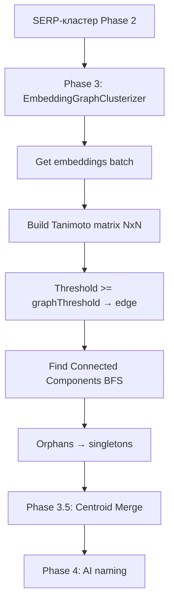

# Замена Phase 3: Threshold Graph Clustering по эмбеддингам

## Мотивация

Текущий Phase 3 использует KMeans + Elbow Method + рекурсивное дробление. 
Проблемы:
- **Необходимо угадывать K** — Elbow Method нестабилен
- **Рекурсия** — подкластеры > sqrt(N) дробятся снова, но границы произвольны
- **ML.NET зависимость** — тяжёлая библиотека ради KMeans
- **Word-Level Split (Phase 3a)** — тупиковый путь, разная длина фраз ломает лексический подход

**Решение:** строить граф связности по Танимото между эмбеддингами целых фраз. 
Детерминированный, без K, без рекурсии, без ML.NET.

## Архитектура замены



## Что изменится

### 1. NEW `Services/EmbeddingGraphClusterizer.cs`

Новый класс, который принимает список фраз + словарь эмбеддингов + порог,
возвращает `List<List<string>>` (подкластеры).

Логика:
- Получить векторы для всех фраз из `allEmbeddings`
- Построить матрицу Tanimoto N×N
- Для каждой пары: если Tanimoto ≥ `_graphThreshold` — добавить ребро
- Поиск компонент связности через BFS (как в `SerpGraphClusterizer`, но по эмбеддингам)
- Фразы без рёбер (изолированные вершины) → отдельные кластеры-синглтоны

```csharp
public class EmbeddingGraphClusterizer
{
    private readonly float _graphThreshold;
    
    public EmbeddingGraphClusterizer(float graphThreshold = 0.88f)
    {
        _graphThreshold = graphThreshold;
    }
    
    public List<List<string>> Clusterize(
        List<string> phrases,
        Dictionary<string, float[]> embeddings)
    {
        // 1. Фильтр: только фразы с эмбеддингами
        // 2. Матрица Tanimoto NxN
        // 3. Построение графа смежности (adjacency list)
        // 4. BFS → Connected Components
        // 5. Изолированные → синглтоны
        // 6. Возврат List<List<string>>
    }
    
    // Использует CentroidMergePass.CalculateTanimoto() — уже есть
}
```

### 2. УДАЛИТЬ `Services/EmbeddingClusterizer.cs`

Полностью. KMeans + Elbow больше не нужны.

### 3. УДАЛИТЬ `Services/WordLevelSplitter.cs`

Word-Level подход признан тупиковым. 
Весь файл (Tokenize, SoftJaccard, HAC, FetchWordEmbeddings) удаляется.

### 4. УДАЛИТЬ `Services/DynamicStopWords.cs`

AI-генерация стоп-слов больше не нужна — Phase 0 удаляется.

### 5. ИЗМЕНИТЬ `Models/BusinessSettings.cs`

**Удалить:**
- `SoftJaccardEnabled` (bool)
- `MegaClusterThreshold` (int)
- `SoftJaccardStopThreshold` (float)
- `WordSimThreshold` (float)

**Добавить:**
```csharp
// ═══════════════════════════════════════════════
// Embedding Graph Clustering (Phase 3)
// ═══════════════════════════════════════════════

/// <summary>
/// Включает графовую кластеризацию по эмбеддингам вместо KMeans.
/// </summary>
public bool GraphClusteringEnabled { get; set; } = true;

/// <summary>
/// Порог Tanimoto для создания ребра в графе эмбеддингов (0.0-1.0).
/// Рекомендуется: 0.88 (эквивалент Cosine ~0.94).
/// Выше = мельче кластеры, ниже = крупнее.
/// </summary>
public float GraphThreshold { get; set; } = 0.88f;
```

### 6. ИЗМЕНИТЬ `settings.json`

Заменить блок `wordSplit` на `graphClustering`:
```json
"graphClustering": {
  "enabled": true,
  "threshold": 0.88
}
```

### 7. ИЗМЕНИТЬ `Program.cs`

- Удалить чтение `wordSplit` (строки 90-103)
- Добавить чтение `graphClustering`

### 8. ИЗМЕНИТЬ `ClusterizationPipeline.cs`

**Удалить Phase 0** (строки 95-115, AI-генерация стоп-слов)

**Заменить Phase 3** (строки 163-237):
```csharp
// Вместо:
var embedClusterizer = new EmbeddingClusterizer { ... };
// цикл по serpClusters с KMeans + рекурсия

// Стало:
var graphClusterizer = new EmbeddingGraphClusterizer(_businessSettings.GraphThreshold);
// цикл по serpClusters:
//   - получить эмбеддинги batch (как сейчас)
//   - graphClusterizer.Clusterize(cluster, allEmbeddings)
//   - добавить подкластеры в finalClusters
//   - лог: "→ N → M подкластеров"
```

**Удалить Phase 3a** (строки 260-319, Word-Level Split)
**Удалить Phase 0** полностью

### 9. УДАЛИТЬ `Microsoft.ML` из `KeywordClusterizer.csproj`

```xml
<!-- Удалить строку: -->
<PackageReference Include="Microsoft.ML" Version="5.0.0" />
```

### 10. ДОКУМЕНТАЦИЯ

Обновить `docs/settings.md` — описать `graphClustering` блок.

## Порядок выполнения

1. `Models/BusinessSettings.cs` — замена полей wordSplit → graphClustering  
2. `settings.json` — замена блока wordSplit → graphClustering  
3. `Program.cs` — замена чтения wordSplit → graphClustering  
4. `Services/EmbeddingGraphClusterizer.cs` — новый файл  
5. `Services/EmbeddingClusterizer.cs` — удалить  
6. `Services/WordLevelSplitter.cs` — удалить  
7. `Services/DynamicStopWords.cs` — удалить  
8. `ClusterizationPipeline.cs` — замена Phase 3, удаление Phase 0 и Phase 3a  
9. `KeywordClusterizer.csproj` — удаление Microsoft.ML  
10. `dotnet build` — проверка сборки  
11. тестовый прогон  

## Риски

- **Порог 0.88 может быть неточным** — потребуется калибровка
- **Орфаны** — часть фраз может не набрать порог ни с одной другой фразой → будут синглтонами. Это нормально (изоляция мусора)
- **Производительность** — матрица N×N для N=100 → 4950 сравнений, ~1ms. ОК.

## Преимущества

- **Детерминизм** — одинаковый результат при одинаковых эмбеддингах
- **Никакого K** — не нужно угадывать количество групп
- **Естественная изоляция мусора** — кривые запросы не притягиваются
- **-1 зависимость** (Microsoft.ML)
- **-3 файла** (EmbeddingClusterizer, WordLevelSplitter, DynamicStopWords)
- **Проще отладка** — понятно, почему кластер split/не split
